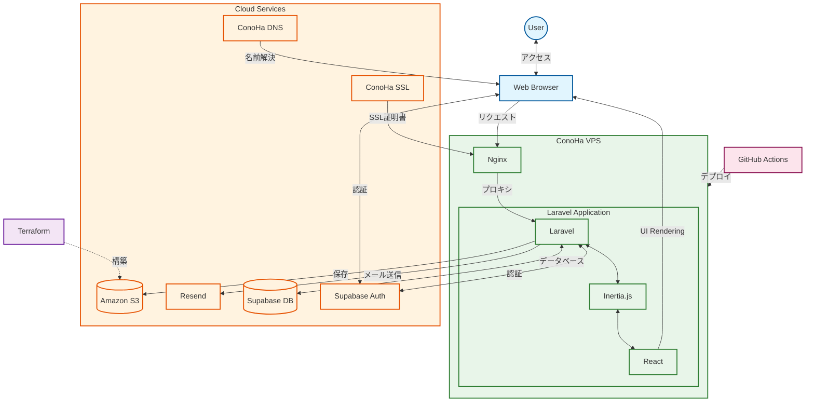

# アーキテクチャー図(仮)

draw.io で作成予定。
暫定で mermaid にしてます。

```mermaid
flowchart TB
    User((User))
    Browser[Web Browser]
    GitHubActions[GitHub Actions]

    subgraph ConoHa_VPS[ConoHa VPS]
        Nginx[Nginx]
        subgraph Laravel_App[Laravel Application]
            Laravel[Laravel]
            Inertia[Inertia.js]
            React[React]
        end
    end

    subgraph Cloud_Services[Cloud Services]
        S3[(Amazon S3)]
        Resend[Resend]
        ConohaDNS[ConoHa DNS]
        ConohaSSL[ConoHa SSL]
        SupaDB[(Supabase DB)]
        SupaAuth[Supabase Auth]
    end

    Terraform[Terraform]

    User <-->|アクセス| Browser
    Browser -->|リクエスト| Nginx
    Nginx -->|プロキシ| Laravel
    Laravel <--> Inertia
    Inertia <--> React
    React -->|UI Rendering| Browser
    Laravel -->|保存| S3
    Laravel -->|メール送信| Resend
    Laravel <-->|データベース| SupaDB
    Laravel <-->|認証| SupaAuth
    Browser <-->|認証| SupaAuth
    ConohaDNS -->|名前解決| Browser
    ConohaSSL -->|SSL証明書| Nginx
    Terraform -.->|構築| S3
    GitHubActions -->|デプロイ| ConoHa_VPS

    classDef default fill:#f0f0f0,stroke:#333,stroke-width:1px
    classDef user fill:#e1f5fe,stroke:#01579b,stroke-width:2px
    classDef vps fill:#e8f5e9,stroke:#2e7d32,stroke-width:2px
    classDef cloud fill:#fff3e0,stroke:#e65100,stroke-width:2px
    classDef infra fill:#f3e5f5,stroke:#6a1b9a,stroke-width:2px
    classDef cicd fill:#fce4ec,stroke:#880e4f,stroke-width:2px

    class User,Browser user
    class Nginx,Laravel,Inertia,React vps
    class S3,Resend,ConohaDNS,ConohaSSL,SupaDB,SupaAuth cloud
    class Terraform infra
    class GitHubActions cicd
    class ConoHa_VPS,Laravel_App vps
    class Cloud_Services cloud
```
