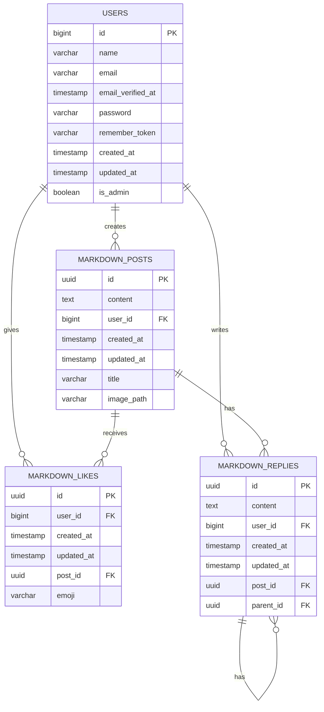

# ER 図

```mermaid
erDiagram
    USERS ||--o{ MARKDOWN_POSTS : creates
    USERS ||--o{ MARKDOWN_LIKES : gives
    USERS ||--o{ MARKDOWN_REPLIES : writes
    MARKDOWN_POSTS ||--o{ MARKDOWN_LIKES : receives
    MARKDOWN_POSTS ||--o{ MARKDOWN_REPLIES : has
    MARKDOWN_REPLIES ||--o{ MARKDOWN_REPLIES : has

    USERS {
        bigint id PK
        varchar name
        varchar email
        timestamp email_verified_at
        varchar password
        varchar remember_token
        timestamp created_at
        timestamp updated_at
        boolean is_admin
    }

    MARKDOWN_POSTS {
        uuid id PK
        text content
        bigint user_id FK
        timestamp created_at
        timestamp updated_at
        varchar title
        varchar image_path
    }

    MARKDOWN_LIKES {
        uuid id PK
        bigint user_id FK
        timestamp created_at
        timestamp updated_at
        uuid post_id FK
        varchar emoji
    }

    MARKDOWN_REPLIES {
        uuid id PK
        text content
        bigint user_id FK
        timestamp created_at
        timestamp updated_at
        uuid post_id FK
        uuid parent_id FK
    }
```
